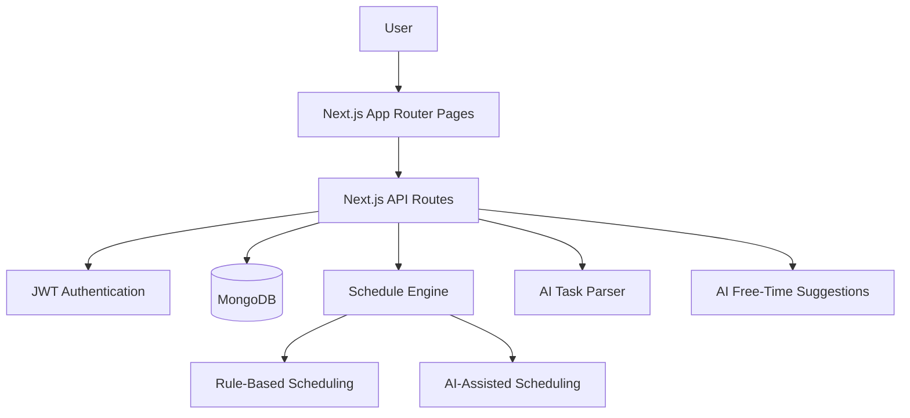

# TaskFlow AI

TaskFlow AI is a goal-driven AI scheduling assistant designed to help users turn long-term aspirations into realistic daily actions. Unlike traditional calendars and to-do lists, which mainly capture tasks and leave planning decisions to the user, TaskFlow AI actively supports prioritization, scheduling, and execution. The system addresses the common problem of urgency bias, where immediate tasks often crowd out important but non-urgent goals such as skill development, health, and personal projects.

The project was built as a web-based decision-support system rather than a passive scheduler. Users can manage tasks and goals, define planning preferences, generate AI-assisted schedules, and adapt their plan when new commitments or missed tasks disrupt the day. The core question TaskFlow AI helps answer is: **What should I do now to get closer to where I want to be?**

## Project Motivation

Modern productivity tools are good at recording what users need to do, but they often provide limited support for deciding when and how work should happen. This creates three problems:

- Users carry the cognitive burden of prioritizing urgent tasks against meaningful long-term goals.
- Planning tools often stop at the planning phase and provide little support during execution.
- When schedules change, users must manually reorganize their remaining tasks.

TaskFlow AI aims to reduce decision fatigue and improve follow-through by generating realistic, goal-aligned schedules. It combines task management, goal management, user preference modeling, AI schedule generation, and free-time suggestions into one adaptive planning workflow.

## Core Features

### User Authentication and Profile

- Secure signup, login, logout, and session validation.
- Password hashing with `bcryptjs`.
- JWT-based authentication.
- User profile settings for working hours, workload capacity, focus style, break preference, and main goals.

### Task Management

- Full CRUD support for tasks.
- Tasks include title, priority, status, deadline, scheduled date, scheduled start time, and estimated duration.
- Scheduled tasks are shown in timetable and schedule views.
- Users can manage immediate commitments and longer pieces of work in one place.

### Goal Management

- Users can create and manage short-term and long-term goals.
- Goals provide context for AI planning and productivity feedback.
- The system is designed to bridge the gap between high-level aspirations and daily execution.

### AI Natural Language Task Parser

- Users can create tasks from plain English input.
- The AI extracts structured task information such as task title, priority, time, deadline, and estimated duration.
- Users can preview parsed results before saving them.

Example:

```txt
Meeting at 10am, lunch at 12:30pm, pick up kids at 4pm, football at 6pm
```

### AI-Based Schedule Generation

- Generates daily schedules by analyzing the user's tasks, goals, deadlines, availability, and planning preferences.
- Supports both rule-based and AI-assisted scheduling logic.
- Helps users decide what to work on next instead of manually constructing a plan from scratch.

### Dynamic Re-planning

- Users can regenerate schedules when the day changes.
- The schedule engine is designed to adapt around missed tasks, new commitments, and changing workload.
- This supports execution, not only initial planning.

### Schedule Display and Timetable View

- Users can view AI-generated schedules in a calendar-style interface.
- Timetable view shows scheduled tasks and free time slots.
- Daily progress helps users understand how much of the planned work has been completed.

### AI Free-Time Suggestions

- Detects available time slots in the timetable.
- Suggests useful activities such as rest, exercise, learning, social time, creativity, and mindfulness.
- Suggestions are personalized using profile preferences and active goals.
- Users can add suggested activities directly to the timetable.

### Productivity Ocean

- A visual productivity interface that gives users a more engaging way to reflect on progress.
- Represents productivity and completion state through a lightweight gamified view.
- Supports the proposal's goal of improving motivation and execution rate.

## User Stories and Implementation Status

| User Story | Status | Where to Test |
|---|---|---|
| As a user, I can create an account and log in securely. | Implemented | `/login`, `/api/auth/*` |
| As a user, I can create, view, update, and delete tasks. | Implemented | `/tasks`, `/api/tasks/*` |
| As a user, I can manage short-term and long-term goals. | Implemented | `/goals`, `/api/goals/*` |
| As a user, I can enter planning preferences. | Implemented | `/profile`, `/api/profile` |
| As a user, I can generate a schedule from my tasks and goals. | Implemented | `/schedule`, `/api/schedules/generate` |
| As a user, I can regenerate my plan when my day changes. | Implemented | `/schedule`, `/api/schedules/regenerate` |
| As a user, I can view my day in a timetable/calendar-style interface. | Implemented | `/timetable` |
| As a user, I can create tasks using natural language. | Implemented | `/tasks`, `/api/tasks/parse` |
| As a user, I can receive suggestions for free time slots. | Implemented | `/timetable`, `/api/free-time-suggestions` |
| As a user, I can see progress in a more motivating visual format. | Implemented | `/productivity-ocean` |

## Requirements Coverage

| Proposal Requirement | Implementation Evidence |
|---|---|
| User authentication | `app/api/auth`, `models/User.ts`, `lib/jwt.ts` |
| Task management system | `app/(dashboard)/tasks/page.tsx`, `app/api/tasks`, `models/Task.ts` |
| Goal management | `app/(dashboard)/goals/page.tsx`, `app/api/goals`, `models/Goal.ts` |
| Task decomposition / structured planning | Task duration, priority, deadline, and scheduling fields |
| AI-based schedule generation | `lib/scheduleEngine`, `app/api/schedules/generate/route.ts` |
| Schedule display and calendar view | `/schedule`, `/timetable` |
| User input for planning | `/profile`, task and goal forms |
| Dynamic re-planning | `app/api/schedules/regenerate/route.ts` |
| Basic gamification | `/productivity-ocean`, `lib/productivityOcean.ts` |

## Technical Stack

- **Framework:** Next.js 16
- **Language:** TypeScript
- **Frontend:** React 19, Tailwind CSS 4
- **Database:** MongoDB with Mongoose
- **Authentication:** JWT and bcryptjs
- **AI Providers:** Gemini and DeepSeek API
- **UI Libraries:** Lucide React, Heroicons

## Architecture



The application separates frontend pages, backend API routes, database models, authentication utilities, AI clients, and scheduling logic. This makes the system easier to test and extend. For example, schedule generation is handled through `lib/scheduleEngine` instead of being embedded directly in page components.

## Project Structure

```txt
app/
  (dashboard)/              Authenticated user pages
  api/                      Backend API routes
  login/                    Login page

components/
  goals/                    Goal UI components
  productivity/             Productivity Ocean UI
  ui/                       Shared UI foundation

lib/
  ai/                       AI config, prompt runner, JSON helpers
  scheduleEngine/           Rule-based, mock, and AI schedule engines
  mongodb.ts                MongoDB connection
  jwt.ts                    Authentication helpers

models/                     Mongoose data models
types/                      Shared TypeScript data types
docs/                       Planning and module documentation
```

## Code Quality and Design Decisions

- Shared TypeScript types are used for tasks, goals, and schedule blocks.
- API routes are separated by domain: authentication, profile, tasks, goals, schedules, and AI features.
- Database access is centralized through reusable Mongoose models.
- AI provider configuration is isolated in `lib/ai/config.ts`.
- Schedule generation logic is separated into dedicated engine modules.
- Documentation is maintained in `docs/` to explain baseline scope, authentication, module design, and frontend style.

## Technical Ambition and Research

TaskFlow AI goes beyond a basic CRUD application by integrating AI into the planning workflow. The most ambitious parts of the project are:

- Natural language task parsing into structured task data.
- Preference-aware AI schedule generation.
- Dynamic re-planning when the user's day changes.
- Personalized free-time suggestions.
- A hybrid scheduling approach that combines deterministic rules with AI-generated recommendations.

These features required research into prompt design, structured AI output, fallback behavior, schedule block modeling, and how to align daily plans with long-term goals.

## Testing and Verification

Automated test files are included for AI utilities and schedule engines:

- `lib/ai/__tests__/config.test.ts`
- `lib/ai/__tests__/geminiClient.test.ts`
- `lib/ai/__tests__/json.test.ts`
- `lib/ai/__tests__/promptRunner.test.ts`
- `lib/ai/prompts/__tests__/schedulePrompt.test.ts`
- `lib/scheduleEngine/__tests__/aiEngine.test.ts`
- `lib/scheduleEngine/__tests__/mockEngine.test.ts`
- `lib/scheduleEngine/__tests__/ruleEngine.test.ts`

Recommended verification commands:

```bash
npm run lint
npm run build
```

## Setup Instructions

### 1. Install dependencies

```bash
npm install
```

### 2. Configure environment variables

Create `.env.local` in the project root:

```env
MONGODB_URI=mongodb://localhost:27017/taskflow
JWT_SECRET=your-secret-key
GEMINI_API_KEY=your-gemini-api-key
GEMINI_MODEL=gemini-3-flash-preview
DEEPSEEK_API_KEY=your-deepseek-api-key
```

### 3. Run the development server

```bash
npm run dev
```

Open:

```txt
http://localhost:3000
```

### 4. Build for production

```bash
npm run build
npm run start
```

## Docker

Run the app and MongoDB together:

```bash
docker compose up --build
```

Then open:

```txt
http://localhost:3000
```

The Compose setup uses `docker.defaults.env` for non-secret defaults so the project can start without private API keys. To enable live AI calls locally, create `.env.docker` and add your private values:

```env
GEMINI_API_KEY=
DEEPSEEK_API_KEY=
JWT_SECRET=
```

`.env.docker` is ignored by Git. Do not commit real API keys.

Useful commands:

```bash
docker compose down
docker compose down -v
docker compose logs -f app
```

## Deployment

Deployment link:

```txt
Add deployed app URL here
```

Deployment checklist:

- Configure `MONGODB_URI`.
- Configure `JWT_SECRET`.
- Configure AI provider API keys.
- Run `npm run build`.
- Confirm login, task creation, goal creation, schedule generation, and AI suggestions work on the deployed site.

## Version Control and Collaboration

The project uses Git for version control and collaboration. To make collaboration evidence clear for assessment, include links to:

- GitHub repository: `https://github.com/UOA-CS732-S1-2026/group-project-giant-pokemon`
- GitHub project board or issue tracker: `https://github.com/UOA-CS732-S1-2026/group-project-giant-pokemon/issues`
- Pull requests or feature branches: `https://github.com/UOA-CS732-S1-2026/group-project-giant-pokemon/pulls`

| Area | Contributor(s) |
|---|---|
| Authentication and profile | Khushba Ahmed (kahm047@aucklanduni.ac.nz) Sreelakshmi Gireesh (sgir748@aucklanduni.ac.nz) |
| Task management/AI task parser | Marvin Xu (zxu734@aucklanduni.ac.nz) |
| Goal management | Chao Yao (cyao907@aucklanduni.ac.nz) |
| Schedule engine | Chao Yao (cyao907@aucklanduni.ac.nz) |
| Timetable/Free-time suggestions | Marvin Xu (zxu734@aucklanduni.ac.nz)|
| Dashboard | Marvin Xu (zxu734@aucklanduni.ac.nz) Chao Yao (cyao907@aucklanduni.ac.nz) Sreelakshmi Gireesh (sgir748@aucklanduni.ac.nz) Khushba Ahmed (kahm047@aucklanduni.ac.nz) |
| Productivity Ocean | Shardul Mangesh Anagal (sana691@aucklanduni.ac.nz) Sreelakshmi Gireesh (sgir748@aucklanduni.ac.nz) |
| Frontend Architecture design | Shardul Mangesh Anagal (sana691@aucklanduni.ac.nz) |
| UI design | Shardul Mangesh Anagal (sana691@aucklanduni.ac.nz) |
| Testing | Harsh Kumar (hkmu884@aucklanduni.ac.nz) |
| Deployment | Chao Yao (cyao907@aucklanduni.ac.nz) |


## Project Management Evidence

Useful planning and documentation files:

- `docs/baseline.md`
- `docs/module_spec.md`
- `docs/userauth.md`
- `docs/frontend-style-guide.md`

These documents show task planning, module boundaries, implementation notes, and design decisions.

## Known Limitations

- AI responses may vary depending on provider availability and prompt interpretation.
- AI features require valid API keys.
- Some advanced reminder features from the original proposal, such as push notifications, are not part of the current MVP.
- The current implementation focuses on a functional prototype and can be extended with deeper calendar integrations later.

## Future Improvements

- Calendar export or Google Calendar integration.
- Push notifications and reminders.
- More detailed streaks, XP, and gamification mechanics.
- Stronger validation for AI-generated schedule data.
- More end-to-end tests for complete user workflows.
